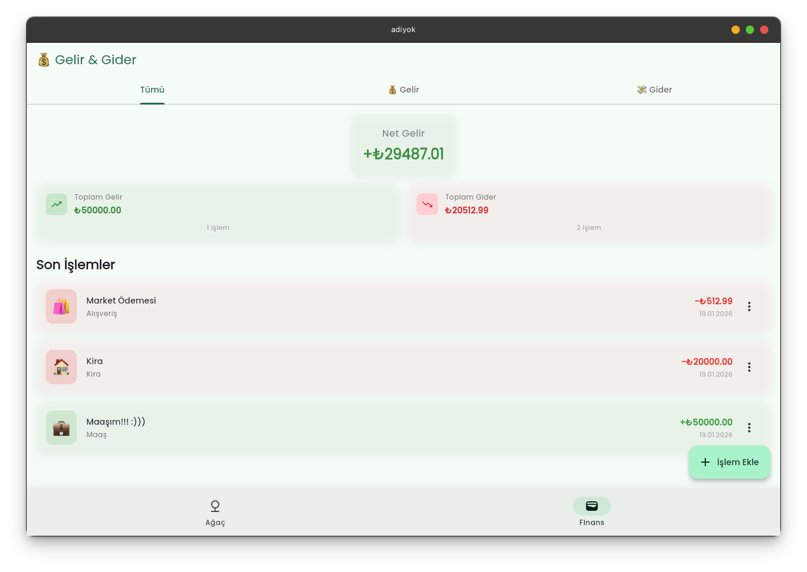

# 🌳 Adiyok - Ağaç & Gelir/Gider Yönetim Uygulaması

Adiyok, modern Flutter uygulaması ile ağaç yapılarını oluşturup yönetebilirken aynı zamanda gelir ve gider takibi yapabileceğiniz, havalı ve profesyonel bir uygulamadır.

## 🎯 Özellikleri

### 🌳 Ağaç Yapısı Yönetimi
- ✅ Kök eleman oluşturma
- ✅ Sınırsız hiyerarşik alt elemanlar
- ✅ Smooth genişlet/daralt animasyonları
- ✅ Düzenleme ve silme işlemleri
- ✅ Derinlik ve nod sayısı istatistikleri

### 💰 Gelir/Gider Takibi
- ✅ Gelir ekleme (5 kategori)
- ✅ Gider ekleme (8 kategori)
- ✅ Renk kodlaması (Yeşil/Kırmızı)
- ✅ Net gelir otomatik hesapla
- ✅ Kategori bazında istatistikler
- ✅ Tarih bazında filtreleme

## 🚀 Hızlı Başlama

```bash
# Paketleri yükle
flutter pub get

# Uygulamayı çalıştır
flutter run
```

**5 dakika içinde başlamak için:** [QUICKSTART.md](QUICKSTART.md) dosyasını okuyun.

## 📱 Ekran Görüntüleri



### Ağaç Yapısı
- Kök elemanlar ve hiyerarşik yapısı
- Genişletilmiş/daraltılmış görüntü
- İstatistik gösterimi

### Gelir/Gider Yönetimi
- Net gelir özeti
- İşlem listeleri
- Kategori özeti
- Filtreleme sekmeleri

## 📚 Dokümantasyon

| Dosya | Açıklama |
|-------|----------|
| [QUICKSTART.md](QUICKSTART.md) | 5 dakikada başlama rehberi |
| [REHBER.md](REHBER.md) | Detaylı kullanım rehberi (Türkçe) |
| [DEVELOPING.md](DEVELOPING.md) | Geliştirici rehberi |
| [CODE_STRUCTURE.md](CODE_STRUCTURE.md) | Kod yapısı ve mimarisi |

## 🏗️ Teknik Detaylar

- **Framework:** Flutter 3.10.4+
- **Language:** Dart 3.0+
- **State Management:** Provider (ChangeNotifier)
- **UI Framework:** Material Design 3
- **Package Manager:** pub.dev

### Bağımlılıklar
```yaml
provider: ^6.0.0          # State Management
google_fonts: ^6.0.0      # Typography
intl: ^0.19.0             # Internationalization
uuid: ^4.0.0              # Unique IDs
```

## 📊 Proje İstatistikleri

- **Toplam Dart Dosya:** 14
- **Toplam Kod Satırı:** 2,466
- **Screens:** 3
- **Providers:** 2
- **Widgets:** 5
- **Models:** 2

## 🎨 Tasarım

- **Color Scheme:** Material Design 3 (Seed: #2D6A4F)
- **Typography:** Google Fonts (Poppins)
- **Icons:** Material Icons + Emoji
- **Animations:** 300ms Smooth Transitions

## 💡 Kullanım Örnekleri

### Ağaç Oluşturma
```
1. "Ağaç" sekmesi → "Kök Eleman" butonuna tıkla
2. "Şirketerim" adını gir
3. "Ekle" butonuna tıkla
4. Menüden "Alt Eleman Ekle"yi seç
```

### İşlem Ekleme
```
1. "Finans" sekmesi → "İşlem Ekle" butonuna tıkla
2. "Gelir" veya "Gider" seç
3. Başlık, tutar, kategori gir
4. "Kaydet" butonuna tıkla
```

## 🔧 Geliştirme

### Proje Yapısı
```
lib/
├── main.dart              # Uygulama giriş noktası
├── models/                # Veri modelleri (2 dosya)
├── providers/             # State Management (2 dosya)
├── screens/               # Tam ekranlar (3 dosya)
└── widgets/               # Widget bileşenleri (5 dosya)
```

### Build
```bash
# Android
flutter build apk --release

# iOS
flutter build ios --release

# Web
flutter build web --release
```

## ❓ Sık Sorulan Sorular

**S: Verilerim nereye kaydediliyor?**
- Şu anda RAM'da (session boyunca). SharedPreferences eklenebilir.

**S: Çevrimdışı çalışır mı?**
- Evet! Tamamen yerel, internet gerektirmez.

**S: Sınırsız veri saklayabilir miyim?**
- Evet, pratik olarak 10,000+ işlem ve ağaç sorunsuz çalışır.

**S: Tema değiştirebilir miyim?**
- Evet, cihaz ayarları otomatik takip edilir.

## 📝 Lisans

MIT Lisansı. Detaylar için [LICENSE](LICENSE) dosyasına bakınız.

## 🤝 Katkıda Bulunma

Geliştirmeler ve öneriler için GitHub issues açabilirsiniz.

## 📞 İletişim

Sorular ve öneriler için lütfen iletişime geçiniz.

---

**Version:** 1.0.0  
**Status:** ✅ Tamamlandı  
**Last Updated:** Ocak 2026

## Getting Started

This project is a starting point for a Flutter application.

- [Lab: Write your first Flutter app](https://docs.flutter.dev/get-started/codelab)
- [Cookbook: Useful Flutter samples](https://docs.flutter.dev/cookbook)

For help getting started with Flutter development, view the
[online documentation](https://docs.flutter.dev/), which offers tutorials,
samples, guidance on mobile development, and a full API reference.

Babam için yaptığım tree proramı.
by erdamn. (Yusuf Erdem Kaymak)