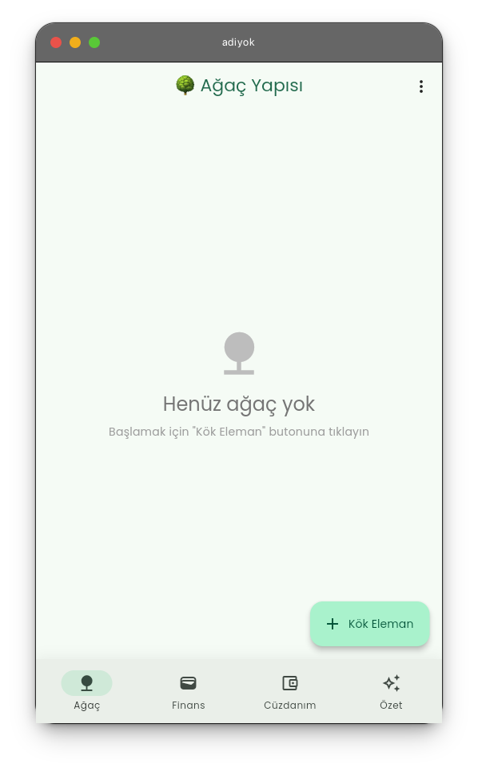
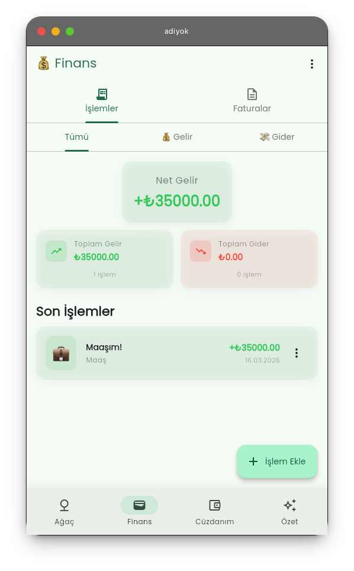
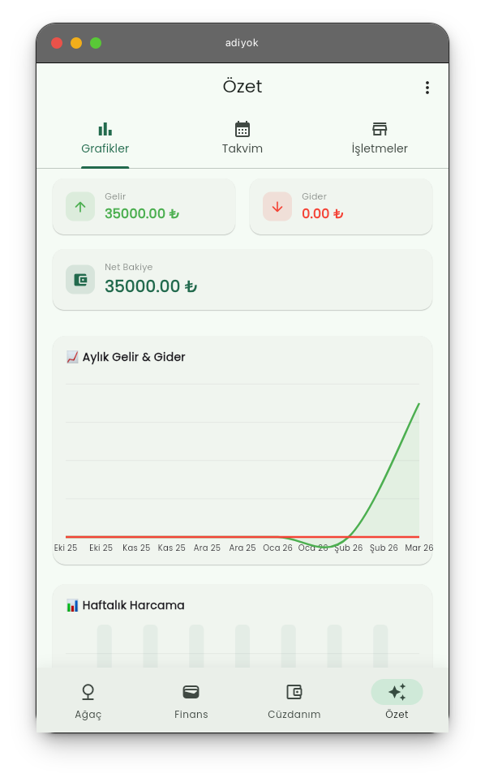
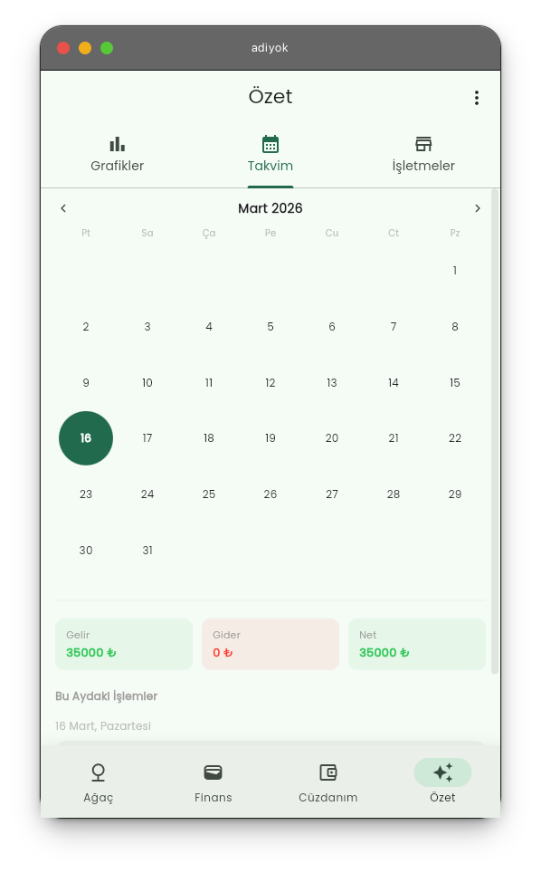
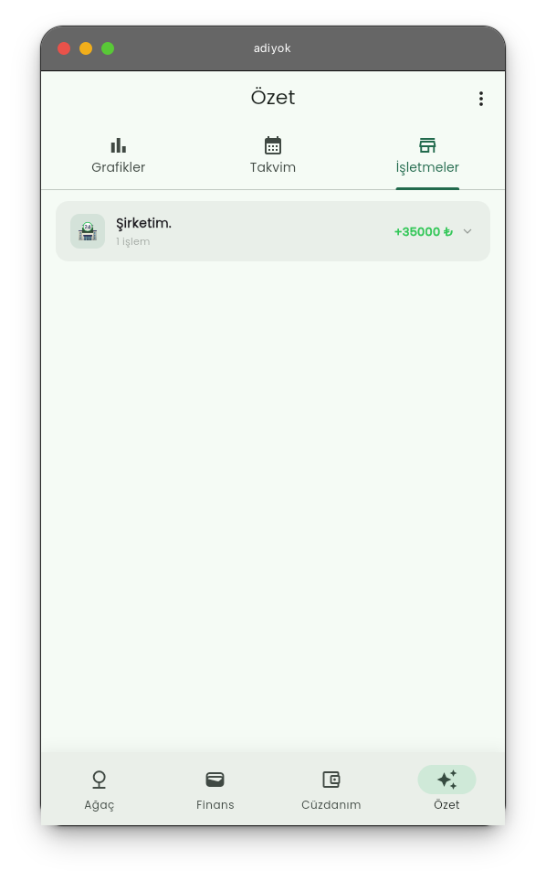
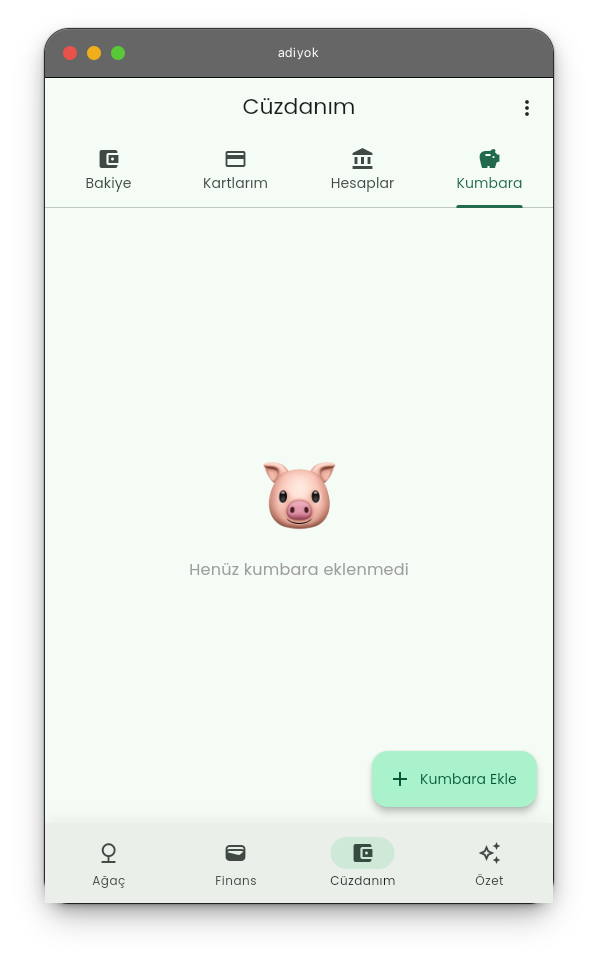

# 🌳 Adiyok

A Flutter app built for my father — combines hierarchical tree management with personal finance tracking.

> *Manage your assets like a tree: structured, growing, and deeply rooted.*

---

## ✨ Features

### 🌳 Tree Management
- Unlimited depth hierarchical structure
- Smooth expand/collapse animations
- Add, edit, and delete nodes at any level
- Node count and depth statistics

### 💰 Finance Tracking
- Income & expense transactions with categories
- Net income calculation
- Category breakdowns and monthly summaries
- Calendar view for transaction history
- Business/vendor grouping in summary screen

### 🧾 Bill Tracking
- Recurring monthly bills (electricity, water, gas, internet, rent, phone, custom)
- Mark bills as paid per month
- Overdue and upcoming bill warnings
- Month navigation to view past/future billing periods

### 💳 Wallet
- Manual or auto-calculated balance
- Card management (bank cards, credit cards)
- Tree-structured accounts (unlimited depth)
- Piggy banks with savings goals and progress tracking

### ⚙️ Other
- Dark / Light / System theme
- Local data persistence (SharedPreferences)
- Works fully offline

---

## 📱 Screenshots

| Tree | Finance | Summary |
|------|---------|---------|
|  |  |  |

| Calendar | Companies | Piggy Bank |
|----------|-----------|------------|
|  |  |  |

---

## 🚀 Getting Started

```bash
# Clone the repo
git clone https://github.com/YusufErdemK/adiyok.git
cd adiyok

# Install dependencies
flutter pub get

# Run
flutter run
```

### Build

```bash
# Android APK
flutter build apk --release

# Android App Bundle (Play Store)
flutter build appbundle --release

# Linux
flutter build linux --release
```

---

## 🏗️ Architecture

```
lib/
├── main.dart
├── models/
│   ├── card_model.dart
│   ├── transaction.dart
│   └── tree_node.dart
├── providers/
│   ├── bill_provider.dart
│   ├── settings_provider.dart
│   ├── transaction_provider.dart
│   ├── tree_provider.dart
│   └── wallet_provider.dart
├── screens/
│   ├── bills_tab.dart
│   ├── home_screen.dart
│   ├── settings.dart
│   ├── summary_screen.dart
│   ├── transaction_screen.dart
│   ├── tree_screen.dart
│   └── wallet_screen.dart
├── services/
│   ├── sound_service.dart
│   └── storage_service.dart
└── widgets/
    ├── add_transaction_dialog.dart
    ├── glass_card.dart
    ├── stats_summary.dart
    ├── transaction_card.dart
    └── tree_node_widget.dart
```

**State management:** Provider (ChangeNotifier)  
**UI:** Material Design 3  
**Typography:** Google Fonts — Poppins  
**Persistence:** SharedPreferences  
**Charts:** fl_chart  

### Dependencies

| Package | Purpose |
|---------|---------|
| `provider` | State management |
| `shared_preferences` | Local storage |
| `google_fonts` | Poppins typography |
| `fl_chart` | Charts and graphs |
| `intl` | Date/number formatting |
| `audioplayers` | UI sound effects |
| `uuid` | Unique IDs |

---

## 📊 Stats

- **26 Dart files** · **~8,000 lines of code**
- **5 providers** · **8 screens** · **6 widgets** · **3 models**
- **Version:** 1.0.0

---

## 🤝 Contributing

See [CONTRIBUTING.md](docs/CONTRIBUTING.md) for guidelines.

---

*Developed with ❤️ by [YusufErdemK](https://github.com/YusufErdemK) for his father.*