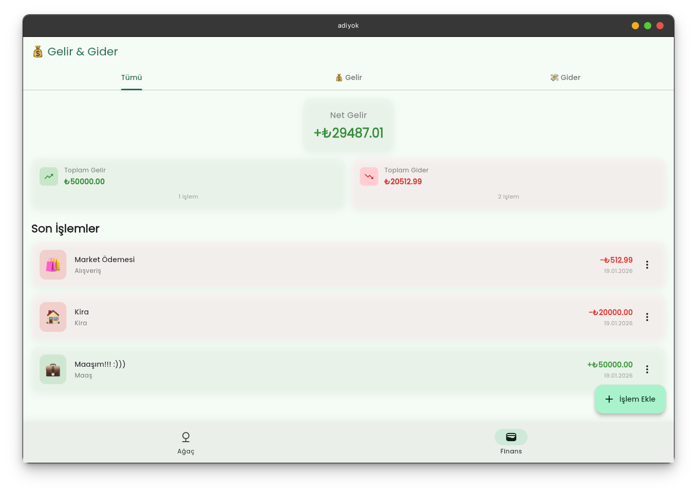

# 🌳 Adiyok - Tree & Finance Management App  

Adiyok is a modern and professional Flutter application designed to help you manage hierarchical tree structures while simultaneously tracking income and expenses.

## 🎯 Features

### 🌳 Tree Structure Management
- ✅ Create root elements
- ✅ Unlimited hierarchical sub-elements
- ✅ Smooth expand/collapse animations
- ✅ Edit and delete operations
- ✅ Depth and node count statistics

### 💰 Income/Expense Tracking
- ✅ Add income (5 categories)
- ✅ Add expenses (8 categories)
- ✅ Color coding (Green/Red)
- ✅ Automatic net income calculation
- ✅ Category-based statistics
- ✅ Date-based filtering

## 🚀 Quick Start

```bash
# Install packages
flutter pub get

# Run the app
flutter run
```

**To get started in 5 minutes:** Check out the [QUICKSTART.md](QUICKSTART.md) file.

## 📱 Screenshots



### Tree Structure

* Root elements and hierarchical view
* Expanded/collapsed states
* Statistics display

### Finance Management

* Net income summary
* Transaction lists
* Category breakdown
* Filter tabs

## 📚 Documentation

| File | Description |
| --- | --- |
| [QUICKSTART.md](QUICKSTART.md) | 5-minute startup guide |
| [GUIDE.md](REHBER.md) | Detailed user guide |
| [DEVELOPING.md](DEVELOPING.md) | Developer guide |
| [CODE_STRUCTURE.md](CODE_STRUCTURE.md) | Code structure and architecture |

## 🏗️ Technical Details

* **Framework:** Flutter 3.10.4+
* **Language:** Dart 3.0+
* **State Management:** Provider (ChangeNotifier)
* **UI Framework:** Material Design 3
* **Package Manager:** pub.dev

### Dependencies

```yaml
provider: ^6.0.0          # State Management
google_fonts: ^6.0.0      # Typography
intl: ^0.19.0             # Internationalization
uuid: ^4.0.0              # Unique IDs
```

## 📊 Project Statistics

* **Total Dart Files:** 17
* **Total Lines of Code:** 2,419
* **Screens:** 3
* **Providers:** 2
* **Widgets:** 5
* **Models:** 2

## 🎨 Design

* **Color Scheme:** Material Design 3 (Seed: #2D6A4F)
* **Typography:** Google Fonts (Poppins)
* **Icons:** Material Icons + Emojis
* **Animations:** 300ms Smooth Transitions

## 💡 Usage Examples

### Creating a Tree

1. Go to "Tree" tab → Click "Add Root Element"
2. Enter a name (e.g., "My Companies")
3. Click "Add"
4. Select "Add Sub-element" from the menu

### Adding a Transaction

1. Go to "Finance" tab → Click "Add Transaction"
2. Select "Income" or "Expense"
3. Enter title, amount, and category
4. Click "Save"

## 🔧 Development

### Project Structure

```
lib/
├── main.dart              # App entry point
├── models/                # Data models (2 files)
├── providers/             # State Management (2 files)
├── screens/               # Full screens (3 files)
└── widgets/               # Widget components (5 files)

```

### Build

```bash
# Android
flutter build apk --release

# iOS
flutter build ios --release

# Web
flutter build web --release

```

## ❓ FAQ

**Q: Where is my data stored?**

* Currently stored in RAM (for the duration of the session). SharedPreferences/Local DB can be added.

**Q: Does it work offline?**

* Yes! It is entirely local and does not require an internet connection.

**Q: Can I store unlimited data?**

* Yes, practically 10,000+ transactions and tree nodes will run smoothly.

**Q: Can I change the theme?**

* Yes, it automatically follows your device's system settings.

## 📝 License

Distributed under the MIT License. See [LICENSE](LICENSE) for more information.

## 🤝 Contributing

Feel free to open GitHub issues for improvements and suggestions.

## 📞 Contact

For questions and suggestions, please contact.

---

**Version:** 1.0.0

**Status:** ✅ Completed

**Last Updated:** January 2026

*Developed with ❤️ by **erdamn** (Yusuf Erdem Kaymak) for his father.*
